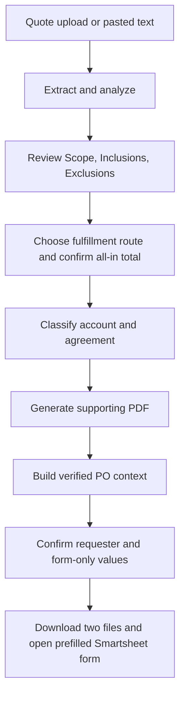

# Purchase Order Workflow Policy and Attachment Handoff

> **Superseded business policy.** The authoritative workflow as of 2026-08-08
> is [`STREAMLINED_RRH_PO_WORKFLOW_HANDOFF_2026-08-08.md`](STREAMLINED_RRH_PO_WORKFLOW_HANDOFF_2026-08-08.md).
> This file remains historical context. Its delivery-based Equipment rule,
> numeric-only Asset ID, always-PO/blank Original PO rule, separate final steps,
> tax confirmation, and older requester-memory behavior must not be restored.

**Status:** authoritative successor handoff  
**Policy date:** 2026-08-06  
**Source of authority:** business-process changes confirmed by the user after a phone conversation  
**Applies to:** the active Streamlit workflow, Smartsheet custom-URL handoff, manual attachment upload, and any future Smartsheet API implementation  
**Supersedes:** prior EPO-versus-MSAPO routing, the full MSAPO document package, and the email-submission route described in older repository documents

This is the first document a future LLM or engineer must read before changing
PO routing, Object Account, Agreement Type, requester behavior, amounts, assets,
attachments, or Smartsheet submission. Older handoffs remain useful as incident
history, but their business rules are not current where they conflict with this
document.

## 1. Executive summary

The old workflow classified a purchase from a mixture of site presence,
shipping, and labor. That model is obsolete. The current classification starts
with what the vendor actually does:

1. onsite labor;
2. onsite rental service;
3. vendor delivery/drop-off without labor; or
4. third-party shipping where the vendor never comes onsite and performs no labor.

Site presence alone does not make a request an MSAPO service request. A vendor
who only drives onsite to drop off material is a Materials/Standard PO. A vendor
who performs labor onsite is a Subcontractor/MSAPO service request whether parts
arrive separately, arrive with the vendor, or do not arrive at all.

Every active route now produces the same supporting package: the original quote
and one simple reviewed PDF containing Scope, Inclusions, and Exclusions. The
tool no longer generates the old full MSAPO form and no longer offers an email
submission flow.

## 2. Non-negotiable outcomes

The following are invariants, not suggestions or defaults:

- Request Type is `PO`.
- Requester is the person currently filling out the request.
- Dispatch WO to Service Center is `NA`.
- Leave Request Completed is blank.
- PO # is blank.
- Work Order # is blank.
- Original PO Number is blank and ignored.
- PO/CO Amount is the grand total including taxes and all fees.
- Asset ID contains only the numeric identifier, without a displayed letter prefix.
- The active attachment package contains exactly the original quote and the Scope/Inclusions/Exclusions PDF.
- The active UI has no email-submission path.
- CSAPO is never selected automatically by this workflow.
- The custom Smartsheet URL never submits a PO; the requester reviews and submits the form.

Future work must not weaken these invariants by making them editable, restoring
an old default, mapping a blank field into the URL, or treating an empty field as
an invitation to guess.

## 3. Canonical routing decision

### 3.1 Decision table

| Route key | Operational question | Object Account | Agreement Type |
|---|---|---|---|
| `onsite_labor` | Will the vendor perform labor onsite? | `5511-SUBCONTRACTOR` | `03 - MSAPO (SERVICE)` |
| `onsite_rental` | Is this an onsite rental service, such as hooking up a rental chiller or providing a rental scissor lift for a repair? | `5411-OUTSIDE RENTALS` | `03 - MRAPO (RENTAL)` |
| `vendor_delivery` | Will the vendor only deliver/drop off onsite, with no vendor labor? | `5301-MATERIALS` | Under `$25,000`: `ON - STANDARD PO UNDER $25K`; otherwise: `OR - STANDARD PO OVER $25K` |
| `third_party_shipping` | Will a third party ship it while the vendor never comes onsite and performs no labor? | `5302-EQUIPMENT` | `OR - EQUIPMENT PO` |

### 3.2 Ordering of questions

The operator-facing choices must be mutually understandable and should be
evaluated in this order:

1. If the vendor performs labor onsite, use `onsite_labor`.
2. If the service is an onsite rental, use `onsite_rental`.
3. If the vendor only delivers or drops off onsite and performs no labor, use `vendor_delivery`.
4. If a third party ships the goods, the vendor never comes onsite, and no vendor labor occurs, use `third_party_shipping`.

Do not ask merely “Is the vendor coming onsite?” That was the source of the old
misclassification. Site presence must be paired with the reason for the visit.

### 3.3 Onsite labor

Onsite vendor labor always means:

- Object Account: `5511-SUBCONTRACTOR`;
- Agreement Type: `03 - MSAPO (SERVICE)`.

This is independent of delivery method. It remains true if parts are shipped by
a third party, carried in by the vendor, delivered ahead of time, or not needed.

Examples:

- a vendor replaces a pump seal onsite;
- a vendor installs equipment onsite;
- a vendor starts up and commissions equipment onsite;
- a vendor performs a repair onsite after a carrier ships the parts.

### 3.4 Onsite rental service

An onsite rental service means:

- Object Account: `5411-OUTSIDE RENTALS`;
- Agreement Type: `03 - MRAPO (RENTAL)`.

Examples supplied with the policy:

- an emergency rental chiller is brought onsite and hooked up;
- a rental scissor lift is provided for a repair.

The spoken shorthand may be “MSAPO rental,” but the exact verified live form
option is `03 - MRAPO (RENTAL)`. Code and tests must use the exact live value.
Do not silently change `MRAPO` to `MSAPO` without verifying that Smartsheet's
actual option changed.

### 3.5 Vendor delivery without labor

A vendor who comes onsite only to deliver or drop off an item is not a
Subcontractor solely because of the visit. This route means:

- Object Account: `5301-MATERIALS`;
- Agreement Type selected from the all-in total.

The threshold is implemented as:

- total strictly below `$25,000.00` → `ON - STANDARD PO UNDER $25K`;
- total equal to or above `$25,000.00` → `OR - STANDARD PO OVER $25K`.

The exact `$25,000.00` boundary is assigned to the higher tier because it does
not satisfy “less than $25K.” Keep the boundary test explicit.

### 3.6 Third-party shipping without site presence or labor

When a third party ships the goods, the vendor never comes onsite, and the
vendor performs no onsite labor, use:

- Object Account: `5302-EQUIPMENT`;
- Agreement Type: `OR - EQUIPMENT PO`.

Do not use this route when the vendor personally drops something off; that is
Materials/Standard PO. Do not use it when the vendor will later perform onsite
labor; that is Subcontractor/MSAPO service.

### 3.7 CSAPO

CSAPO is intentionally excluded from automatic selection. It is rare and
requires special legal approval. The existing option may remain in a validated
option catalog for schema awareness, but the active questionnaire must not
route ordinary work to it.

## 4. Field-by-field policy

| Logical field | Live label | Source | Rule |
|---|---|---|---|
| `request_type` | `REQUEST TYPE` | constant | Always `PO`. |
| `requester_name` | `REQUESTER` | current operator | Person filling out this request; entered/recalled in the inline handoff. |
| `job_number` | `JOB NUMBER` | operator/known RRH list | RRH defaults to `RRH-695400022-O&M`; other exact options remain reviewable. |
| `site_location` | `SITE NUMBER / LOCATION` | reviewed routing | Must match the live form's option wording. |
| `cost_code` | `COST CODE` | reviewed routing | Derived for known RRH sites or entered explicitly. |
| `object_account` | `OBJECT ACCOUNT` | canonical classifier | Locked; never freely chosen in the handoff. |
| `agreement_type` | `AGREEMENT TYPE FOR PO` | canonical classifier | Locked; never freely chosen in the handoff. |
| `leave_request_completed` | `LEAVE REQUEST COMPLETED` | none | Always blank and omitted. |
| `po_number` | `PO #` | none | Always blank and omitted. |
| `work_order_number` | `WORK ORDER #` | none | Always blank and omitted. |
| `original_po_number` | `ORIGIONAL PO NUMBER` in current live schema | none | Ignored, always blank, and omitted. Preserve the external misspelling only if referencing the historical live column. |
| `total` | `PO/CO AMOUNT` | operator-confirmed quote total | Grand total including taxes and every fee. |
| `vendor` | `VENDOR NAME` | quote analysis/review | Reviewed vendor name. |
| `contact_name` | `VENDOR CONTACT NAME` | quote analysis or account/vendor memory | Required reviewed representative. |
| `contact_email` | `VENDOR CONTACT EMAIL` | quote analysis or account/vendor memory | Required and validated. |
| `description_of_work` | `DESCRIPTION OF WORK` | reviewed Scope/Inclusions/Exclusions | Same reviewed content represented in the support PDF. |
| `asset_id` | `ASSET ID` | selected asset | Numeric portion only; blank when no applicable numeric asset exists. |
| `dispatch_service_center` | `DISPATCH WO TO SERVICE CENTER?` | constant | Always exact value `NA`. |
| `instructions` | `ADDITIONAL INFORMATION IF NEEDED` | reviewed notes | Optional. |

## 5. Always-blank controls

Four fields are represented in the logical schema so validators can detect a
bad caller, but they are absent from the normal form order and deployment field
map:

```text
leave_request_completed
po_number
work_order_number
original_po_number
```

Defense is layered:

1. `app/po_context.py` assigns empty strings.
2. `app/smartsheet.py` identifies them in `ALWAYS_BLANK_FIELDS`.
3. validation reports an error if any caller supplies a nonempty value.
4. custom-URL generation skips them even if an environment map mistakenly includes them.
5. manual Copy rows skip them.
6. future direct API cell generation skips them.
7. `render.yaml` and `.env.example` omit their mappings.

This defense is deliberate. Do not remove the logical fields entirely: keeping
them known allows the integration to fail loudly if a future caller attempts to
populate them.

## 6. Requester policy and device memory

### 6.1 Ownership

Requester is always the human currently filling out the form. It is not:

- the application author;
- a deployment-wide environment value;
- the vendor contact;
- an administrator;
- a person inferred from a quote;
- the last requester on another browser.

`EPC_REQUESTER_NAME`, if still present in an old environment, is intentionally
ignored by the active PO context. The inline handoff collects the requester.

### 6.2 Browser-scoped suggestion

The existing three-use memory remains a convenience, not a source of authority:

- a random opaque cookie identifies one browser profile;
- only a hash of that token is stored server-side;
- a requester becomes suggested after the same name is used for three distinct verified PO contexts;
- Streamlit reruns cannot inflate the count;
- the user can forget the requester on a shared device;
- cookies blocked or cleared merely disable the suggestion;
- the visible requester field remains reviewable on every PO.

The memory mechanism must never silently submit or make the name immutable.

## 7. PO/CO Amount

`PO/CO AMOUNT` is the total amount the organization expects to pay, including:

- line-item materials or equipment;
- labor;
- sales or other applicable tax;
- freight;
- delivery;
- fuel or service surcharges;
- setup, hookup, mobilization, or similar fees;
- every other quoted fee.

The UI labels this as the all-in amount and requires an explicit confirmation.
The classifier uses the reviewed total for the Standard PO threshold. A missing
or malformed total blocks `vendor_delivery` classification rather than guessing
a tier.

When subtotal, tax, and total are all available, the existing arithmetic check
continues to flag a difference greater than one cent. That check is supplemental;
it does not prove that all fees were captured, so operator confirmation remains
required.

## 8. Asset ID normalization

The live field expects the number, not a registry display prefix. Examples:

| Displayed registry value | Smartsheet value |
|---|---|
| `A001234` | `001234` |
| `EEA-CWP-07` | `07` |
| `Asset 9001` | `9001` |
| `None Applicable` | blank |

Leading zeroes are preserved. Validation rejects a populated Asset ID that
contains letters or punctuation. If a selected registry value contains no
numeric portion, the handoff blocks and asks for correction instead of sending
the display label.

The current normalizer uses the final numeric run from the registry display
value. If a future asset registry uses a meaningful multi-part numeric ID, update
the registry schema and tests rather than loosening Smartsheet validation.

## 9. Attachment policy

### 9.1 Required package

Every route requires exactly two files:

1. **Original quote**
   - For an uploaded quote, preserve the original bytes unchanged.
   - Verify the upload hash and extracted text still correspond to the active analysis.
   - For pasted text with no active matching upload, create `Vendor Quote.txt` from the analyzed text.
   - Never reuse a stale file from an earlier quote in the same browser session.

2. **Scope/Inclusions/Exclusions PDF**
   - Generate directly from the reviewed scope and selected inclusion/exclusion lists.
   - Keep it simple; it is a supporting summary, not an MSAPO agreement.
   - It must be a real PDF beginning with `%PDF-`.
   - Its signature must match the current analysis token, contract, site, Inclusions, and Exclusions.
   - If one of those inputs changes, discard or block the stale PDF and require regeneration.

### 9.2 Removed package behavior

The following are no longer part of the active workflow:

- filling the old MSAPO template;
- generating an MSAPO DOCX;
- converting that DOCX to PDF;
- attaching quote + DOCX + converted PDF;
- using quote-only behavior for the old EPO mode.

Legacy modules remain in the repository only to avoid an unnecessarily broad
historical-code deletion. They are not imported by `app/web_ui.py`. Their
presence is not permission to restore the old package.

### 9.3 Smartsheet upload limitation

The custom URL carries text/default field values only. It cannot place browser
files into the form's file-upload control. The active flow therefore:

1. provides a download button for the renamed original quote;
2. provides a download button for the Scope/Inclusions/Exclusions PDF;
3. opens the prefilled Smartsheet form in a new tab;
4. tells the requester to upload both files;
5. keeps the source page open for downloads and field-level Copy fallbacks.

Do not claim files are attached merely because the form fields are prefilled.
Direct attachment automation would require a separately approved and configured
Smartsheet API route.

## 10. Email-flow removal

The active workflow no longer generates or submits email. Specifically,
`app/web_ui.py` no longer imports or calls:

- `build_eml`;
- Outlook draft creation;
- Apple Mail share behavior;
- email recipient selection;
- the prior email backup button;
- send-completion tracking.

The active Step 5 contains one route: **Prepare Smartsheet submission**.

`app/eml_builder.py` remains dormant historical code. A future agent must not
infer from its presence that email is still required. Restoring email requires a
new explicit user request and new acceptance tests.

## 11. Active architecture



The handoff stays inline on the root Streamlit page. Earlier production incidents
showed that changing Streamlit pages on mobile could create a fresh session and
lose widget-backed quote state. The legacy page is therefore a non-submitting
notice that links back to the root workflow.

## 12. Canonical state and signatures

The active analysis uses an `analysis_token` derived from the quote text.
Important session keys include:

```text
analysis
analysis_token
quote_text
uploaded_file_bytes
uploaded_file_name
extract_hash
purchase_route_{analysis_token}
contract_{analysis_token}
site_{analysis_token}
gsite_{analysis_token}_{contract}
gsitetxt_{analysis_token}_{contract}
total_{analysis_token}
total_confirmed_{analysis_token}
scope_pdf_bytes
scope_pdf_signature
```

The generated PDF signature contains:

- analysis token;
- selected contract;
- selected site;
- reviewed Inclusions;
- reviewed Exclusions.

The `POContext.context_id` hashes sorted fields and attachment fingerprints. It
namespaces inline Smartsheet widgets and lets requester-memory counting identify
one distinct prepared PO rather than one rerun.

## 13. File-level implementation notes

### `app/po_rules.py`

Single source of truth for route keys, operator labels, exact account values,
exact agreement values, the `$25,000` boundary, currency parsing, and asset
normalization. UI code and context generation both call `classify_po` so preview
and submission cannot drift independently.

### `app/web_ui.py`

Reframed the product as Purchase Order Process Control. It now:

- presents the four fulfillment choices;
- renders the canonical account/agreement result;
- collects and confirms the all-in amount;
- generates the lightweight PDF;
- offers only the inline Smartsheet handoff;
- removes the email and full-document generation routes.

### `app/scope_pdf.py`

Generates a letter-size, paginated PDF with safe font normalization, wrapping,
long-token handling, page numbers, and the three reviewed sections. It uses
PyMuPDF, already required by the application, rather than adding a new runtime
dependency or depending on LibreOffice.

### `app/po_context.py`

Builds the verified source snapshot. It applies the canonical classifier,
normalizes the asset, locks PO/NA/blank fields, verifies original-quote identity,
requires the current PDF signature, requires exactly two attachments, and
blocks an unconfirmed all-in total.

It intentionally ignores deployment requester defaults. Requester is collected
later from the operator.

### `app/smartsheet.py`

Maintains the exact live labels and exact option catalogs. It:

- excludes always-blank fields from default order;
- skips them in custom URLs, Copy rows, and future API cells;
- rejects any nonempty attempt to populate them;
- rejects nonnumeric Asset IDs;
- uses the canonical account/agreement constants;
- uses `%20` percent encoding required by the live custom URL;
- labels the two downloads Quote and Scope;
- retains a disabled, fail-closed future API adapter.

### `app/smartsheet_inline.py`

Keeps the mobile-safe handoff on the root page. The operator enters the
requester, reviews job/site/notes, sees locked classification, downloads both
files, and opens the prefilled form. The free-form Object Account selector and
email backup are removed.

### `render.yaml` and `.env.example`

The form map contains only fields that may be populated. It intentionally omits
the four always-blank fields. Prefill remains enabled; direct API mode remains
disabled.

### `pages/2_Smartsheet_PO.py`

Non-submitting compatibility notice for an old bookmark. It contains no PO
controls and no attachment or API action.

## 14. Exact deployed custom-URL map

The supported mapping is:

```json
{
  "request_type": "REQUEST TYPE",
  "requester_name": "REQUESTER",
  "job_number": "JOB NUMBER",
  "site_location": "SITE NUMBER / LOCATION",
  "cost_code": "COST CODE",
  "object_account": "OBJECT ACCOUNT",
  "agreement_type": "AGREEMENT TYPE FOR PO",
  "total": "PO/CO AMOUNT",
  "vendor": "VENDOR NAME",
  "contact_name": "VENDOR CONTACT NAME",
  "contact_email": "VENDOR CONTACT EMAIL",
  "description_of_work": "DESCRIPTION OF WORK",
  "asset_id": "ASSET ID",
  "dispatch_service_center": "DISPATCH WO TO SERVICE CENTER?",
  "instructions": "ADDITIONAL INFORMATION IF NEEDED"
}
```

Do not add these mappings:

```text
leave_request_completed
po_number
work_order_number
original_po_number
send_copy_email
```

## 15. Validation and regression coverage

The focused suite covers:

- all four route classifications;
- exact Object Account and Agreement Type values;
- `$24,999.99`, `$25,000.00`, and above-threshold behavior;
- malformed or missing totals;
- numeric asset normalization and leading zeroes;
- exact two-file context construction;
- original uploaded bytes versus pasted-text fallback;
- stale PDF rejection;
- all-in total confirmation;
- missing-route blocking instead of legacy fallback;
- PDF headings, metadata, page output, and long-content pagination;
- always-blank field omission from custom URL and Copy rows;
- always-blank field rejection in validation;
- future API cell omission for always-blank fields;
- nonnumeric Asset ID rejection;
- exact `%20` Smartsheet URL encoding;
- exact form labels and option catalogs;
- removal of email UI entrypoints;
- one inline Smartsheet route and no page-switch navigation;
- requester-memory behavior;
- API idempotency and attachment-reconciliation safeguards.

Tests must never submit a live Smartsheet form or send an email. Production
acceptance opens and inspects a synthetic prefilled form without submitting it.

## 16. Deployment and acceptance procedure

### 16.1 Before merge

1. Run `python -m pytest -q` in a normal environment.
2. Confirm syntax compilation of changed Python modules.
3. Inspect the PR diff for credentials, real quotes, and unrelated changes.
4. Confirm `SMARTSHEET_API_MODE` remains `disabled`.
5. Confirm the PR and commit message point to this document.

### 16.2 After merge

1. Confirm Render deploys the exact merge commit from `main`.
2. Confirm the service and health endpoint return HTTP 200.
3. Check startup logs for configuration or import errors.
4. Refresh the production page in a clean browser session.
5. Use a synthetic quote; do not use confidential production data for a smoke test.
6. Exercise each fulfillment route and confirm the classification preview.
7. Confirm `$24,999.99` selects the under tier and `$25,000.00` selects the higher tier.
8. Generate the PDF and inspect Scope, Inclusions, and Exclusions.
9. Open the inline handoff and enter a synthetic requester.
10. Confirm the prepared package has exactly two downloads.
11. Open the prefilled form without submitting it.
12. Confirm PO, requester, job, site, cost code, account, agreement, total, vendor, scope, numeric asset, and NA populate as expected.
13. Confirm Leave Request Completed, PO #, Work Order #, and Original PO Number remain blank.
14. Confirm there is no email-submission control.
15. Confirm there is no automatic Smartsheet submission.

### 16.3 Attachment acceptance

Because custom URLs cannot attach local files, the smoke test can verify
downloads and instructions without creating a row. A controlled real submission
should additionally confirm the operator can upload:

- the unchanged original quote; and
- the Scope/Inclusions/Exclusions PDF.

Do not report “attachments passed” based only on the URL or field-prefill test.

## 17. Direct API remains disabled

The repository has a guarded API foundation, but production must remain
`SMARTSHEET_API_MODE=disabled` until all of these exist:

1. a least-privilege service account/token;
2. a confirmed destination sheet ID;
3. exact writable column IDs;
4. exact titles, types, and picklist options;
5. a dedicated writable submission-key column;
6. verified attachment permissions;
7. dry-run validation against live schema;
8. one controlled row-plus-two-attachments round trip;
9. a rollback and duplicate-reconciliation owner;
10. confirmation that the single-instance persistent state remains available.

The current manual custom-URL route is the approved active route. Do not enable
API mode merely to avoid manual attachment upload without the complete gate.

## 18. Historical documents

Older documents record real incidents and useful safeguards, including mobile
session loss, exact-label mapping, `%20` encoding, and API idempotency. Their old
workflow descriptions include email, EPO mode, and full MSAPO generation. Where
those descriptions conflict with this handoff, this handoff wins.

Specifically obsolete statements include:

- “site visit means MSAPO”;
- “equipment-only EPO mode” as a top-level product mode;
- “standard orders generate a full MSAPO document”;
- “email is the source workflow or backup route”;
- “Original PO Number may be copied when populated”;
- “Object Account remains freely editable”;
- “the package is quote + DOCX + PDF”;
- “the package is quote only for EPO.”

Do not delete incident history solely because the terminology is old. Add a
supersession banner and preserve the investigation record.

## 19. Failure modes specific to this change

### FM-P01 — Site presence reintroduces old classification

- **Failure:** vendor drop-off is classified as Subcontractor/MSAPO service.
- **Control:** four explicit route choices and centralized classifier.
- **Test:** vendor delivery → Materials + Standard PO.

### FM-P02 — Shipped parts hide onsite labor

- **Failure:** carrier shipment causes an Equipment PO even though the vendor performs labor onsite.
- **Control:** onsite labor takes precedence over delivery method.
- **Test:** labor route always → Subcontractor + MSAPO service.

### FM-P03 — Standard PO uses subtotal

- **Failure:** threshold or PO/CO Amount excludes tax/freight/fees.
- **Control:** all-in label, explicit confirmation, total parser, arithmetic warning.
- **Test:** unconfirmed total blocks handoff.

### FM-P04 — Exactly `$25,000` falls into the under tier

- **Failure:** code uses `<=` for the under option.
- **Control:** strict `< 25000` comparison.
- **Test:** `$25,000.00` → higher tier.

### FM-P05 — Asset display prefix reaches Smartsheet

- **Failure:** `A001234` or `EEA-CWP-07` is sent verbatim.
- **Control:** canonical normalization plus digits-only validation.
- **Test:** expected `001234` and `07`.

### FM-P06 — A reserved field is filled by a future caller

- **Failure:** blank field is accidentally mapped or sent by API.
- **Control:** constant empty context values, validation, URL/Copy/API omission.
- **Test:** malicious nonempty values never leave the app and raise errors.

### FM-P07 — Requester becomes the app author or a global default

- **Failure:** deployment environment silently owns every request.
- **Control:** ignore requester environment default; collect operator input.
- **Test:** injected `EPC_REQUESTER_NAME` does not populate context.

### FM-P08 — Old full MSAPO remains attached

- **Failure:** dormant generator is accidentally reconnected.
- **Control:** active imports and AST tests require `build_scope_pdf`, reject old generator/converter/email entrypoints, and require two attachments.

### FM-P09 — Prefill is mistaken for attachment upload

- **Failure:** operator submits a row with no files.
- **Control:** numbered instructions, two adjacent downloads, explicit custom-URL limitation, and package preflight.

### FM-P10 — Old email flow remains discoverable

- **Failure:** users follow an obsolete submission path.
- **Control:** one Step 5 Smartsheet button; no email UI imports or buttons.

## 20. Rollback guidance

If the new build fails technically:

1. roll Render back to the previous known-good commit;
2. keep direct API mode disabled;
3. continue using the verified Smartsheet form manually;
4. do not restore old business classifications as a “temporary” shortcut;
5. preserve the quote and create the simple Scope/Inclusions/Exclusions PDF manually if necessary;
6. record which invariant or route failed and add a regression test before redeploying.

A technical rollback is not a policy rollback. The business rules in this
document remain authoritative unless the user explicitly changes them again.

## 21. Instructions for a future LLM

Before taking action:

1. read this entire document;
2. inspect `app/po_rules.py` before touching UI conditionals;
3. inspect both `render.yaml` and live Render environment overrides;
4. keep API mode disabled unless every activation gate is satisfied;
5. preserve exact Smartsheet label and option spelling;
6. distinguish field prefilling from file attachment;
7. use a synthetic quote and never submit a production test row without explicit authorization;
8. update tests, this handoff, the PR body, and the squash/merge commit message;
9. state any ambiguity explicitly instead of guessing;
10. do not reintroduce email, EPO mode, or the full MSAPO form from dormant code.

When investigating a regression, trace this chain:

```text
web_ui route selection
→ po_rules.classify_po
→ po_context.build_po_context
→ smartsheet.validate_submission_fields
→ smartsheet.build_prefilled_form_url
→ smartsheet_inline.render_inline_smartsheet_handoff
→ live custom form
```

For attachment issues, trace separately:

```text
active upload/pasted quote identity
→ scope_pdf signature
→ POContext.attachments
→ preflight_attachments
→ download_names
→ operator upload in Smartsheet
```

## 22. Phone-change confirmation checklist

This checklist mirrors the business conversation and can be reused when
confirming the rollout with Ashley and Chris:

- [ ] Leave Request Completed stays blank.
- [ ] PO # stays blank.
- [ ] Work Order # stays blank.
- [ ] Requester is the person filling out the request.
- [ ] Onsite labor maps to Subcontractor/MSAPO service.
- [ ] Onsite rental maps to Outside Rentals/MRAPO rental.
- [ ] Vendor drop-off without labor maps to Materials/Standard PO.
- [ ] Third-party shipping with no vendor visit/labor maps to Equipment/Equipment PO.
- [ ] Standard PO tier uses the all-in total.
- [ ] CSAPO is ignored absent legal approval.
- [ ] Original PO Number is ignored and blank.
- [ ] PO/CO Amount includes every fee and tax.
- [ ] Asset ID sends numbers only.
- [ ] Dispatch WO to Service Center is NA.
- [ ] Package is original quote + Scope/Inclusions/Exclusions PDF.
- [ ] Full MSAPO form is not generated.
- [ ] Email submission is removed.
- [ ] Smartsheet fields are prefilled, but both files are uploaded manually.

## 23. Final authority rule

If code, comments, tests, environment values, old documents, or a future model's
assumptions conflict with this handoff, stop and resolve the conflict before
submission. Do not make the system “helpfully” choose an old EPO/MSAPO rule. A
missing value or blocked handoff is safer than a plausible but wrong financial
classification.
